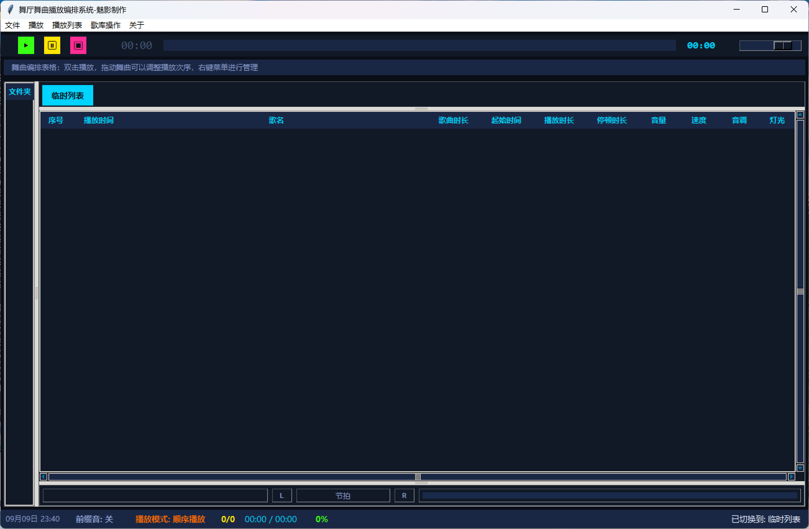

[](./images/wechat_pay.jpg?raw=true)

# Dance-Hall-Music-Playback-and-Scheduling-System

## 界面预览



# 🎵 舞厅舞曲播放编排系统-魅影制作


<div align="center">

**专业级舞厅舞曲播放与编排解决方案**

魅影制作出品

</div>

## 📋 目录
- 项目简介

- 核心特性

- 系统架构

- 安装指南

- 快速上手

- 功能详解

- 音频处理技术

- 配置管理

- 快捷键参考

- 常见问题

- 性能优化

- 致谢

## 🎯 项目简介
舞厅舞曲播放编排系统是一款专为舞厅、夜店、舞蹈培训机构等场所设计的专业音乐播放管理软件。系统集成了先进的音频处理技术，支持多播放列表管理、精确的时间编排、实时音频效果调节等功能，为DJ和舞厅运营者提供了一站式的音乐播放解决方案。

## 适用场景
- 🏢 舞厅/夜店：专业舞曲播放与管理

- 💃 舞蹈培训机构：课程音乐编排与调度

- 🎪 活动策划：多类型音乐活动管理

- 🎵 个人DJ：专业级音乐混音与编排

## ✨ 核心特性
### 🎵 音频播放
- 多格式支持：MP3、WAV、FLAC、M4A、AAC、OGG

- 高保真播放：44.1kHz采样率，16位深度，双声道

- 无缝过渡：专业级淡入淡出效果

- 精确控制：毫秒级播放位置控制

### 🎛️ 音频效果
- 实时变速：50%-150%速度调节，变速不变调

- 音调控制：±12半音范围调节

- 七段均衡器：60Hz-15kHz专业频段调节

- 音量控制：0-100%精确音量管理

### 📋 播放列表
- 多列表管理：支持创建多个独立播放列表

- 智能排序：拖拽式歌曲排序

- 时间编排：自动计算播放时间

- 模式切换：顺序、随机、单曲循环

### ⏱️ 时间编排
- 起始时间：精确到秒的起始位置设置

- 播放时长：自定义播放片段长度

- 停顿时长：歌曲间自动停顿控制

- 自动调度：全自动播放流程

## 🏗️ 系统架构
text
<pre>
┌─────────────────────────────────────────────────────────────┐
│                    DanceMusicPlayer (主控制器)                │
├─────────────────────────────────────────────────────────────┤
│                                                             │
│  ┌──────────────┐  ┌──────────────┐  ┌──────────────┐     │
│  │ MusicPlayer  │  │  Playlist    │  │   Config     │     │
│  │    Core      │  │   Manager    │  │   Manager    │     │
│  └──────────────┘  └──────────────┘  └──────────────┘     │
│         │                 │                 │               │
│  ┌──────▼──────┐  ┌──────▼──────┐  ┌──────▼──────┐        │
│  │   Pygame    │  │   JSON       │  │   JSON       │        │
│  │   Mixer     │  │   Storage    │  │   Storage    │        │
│  └──────────────┘  └──────────────┘  └──────────────┘     │
│                                                             │
│  ┌──────────────┐  ┌──────────────┐  ┌──────────────┐     │
│  │   Librosa    │  │  SoundFile   │  │   Mutagen    │     │
│  │  (音频处理)   │  │  (文件读写)   │  │  (元数据)    │     │
│  └──────────────┘  └──────────────┘  └──────────────┘     │
│                                                             │
│  ┌──────────────────────────────────────────────────┐      │
│  │              Tkinter GUI (用户界面)                │      │
│  └──────────────────────────────────────────────────┘      │
└─────────────────────────────────────────────────────────────┘
</pre>  

## 📦 安装指南
**系统要求**
| 组件 | 最低要求 | 推荐配置 |
| :--- | :--- | :--- |
|Python	|3.8+	|3.10+|
|内存|	4GB	|8GB+|
|存储	|1GB 可用空间	|5GB+ SSD|
|操作系统|	Windows 7+ / macOS 10.14+ / Linux|	Windows 10+ / macOS 11+ / Ubuntu 20.04+|

**安装步骤**
1. 克隆或下载项目
bash
```
git clone https://github.com/yourusername/dance-hall-music-player.git
cd dance-hall-music-player
```
2. 创建虚拟环境（推荐）
bash
```
# Windows
python -m venv venv
venv\Scripts\activate

# macOS / Linux
python3 -m venv venv
source venv/bin/activate
```

3. 安装依赖
bash
```
pip install -r requirements.txt
```
4. requirements.txt 内容
txt
```
pygame>=2.5.0
mutagen>=1.47.0
librosa>=0.10.0
soundfile>=0.12.0
numpy>=1.24.0
Pillow>=10.0.0
```
5. 可选：安装拖放支持
bash
```
pip install tkinterdnd2
```
6. 运行程序
bash
python ballroom_player.py

## 🚀 快速上手

第一步：添加音乐

1.拖拽添加：直接将音频文件拖入窗口

2.文件对话框：`Ctrl+O` 打开文件选择

3.文件夹批量导入：`Ctrl+Shift+O` 导入整个文件夹

第二步：播放音乐
- 双击播放列表中的歌曲即可播放

- 使用空格键快速播放/暂停

- 左右方向键切换上一首/下一首

第三步：调整效果
- 音量：右侧滑块或 F2/F3 快捷键

- 速度：底部"速度"滑块（50%-150%）

- 音调：底部"音调"滑块（-12到+12半音）

第四步：编排播放
- 右键点击歌曲 → 选择"编辑歌曲信息" → 设置：

- 起始时间

- 播放时长

- 停顿时长

- 音量、速度、音调

## 📖 功能详解
### 🎵 播放控制
**基本操作**
|功能|	操作方式|	说明|
| :--- | :--- | :--- |
|播放	|双击歌曲 / 空格键	|从配置的起始时间开始播放|
|暂停	|暂停按钮 / 空格键	|带淡出效果的暂停|
|停止	|停止按钮	|完全停止播放|
|上一首	|左方向键	|切换到上一首歌曲|
|下一首	|右方向键	|切换到下一首歌曲|

**播放模式**
- 顺序播放：按列表顺序循环播放

- 单曲循环：重复播放当前歌曲

- 随机播放：随机选择歌曲播放

### 🎛️ 音频效果
**变速变调系统**

系统采用先进的音频处理算法，实现高质量的变速变调：

text

`原始音频 → Librosa分析 → 时间拉伸/音调变换 → 临时WAV文件 → Pygame播放`

**速度调节**：

- 范围：50% - 150%

- 技术：Phase Vocoder 时间拉伸

- 特性：变速不变调

**音调调节**：

- 范围：-12 到 +12 半音

- 技术：Pitch Shift 算法

- 特性：变调不变速

**七段均衡器**
|频段|	频率|	调节范围|
| :--- | :--- | :--- |
|超低频	|60Hz	|±12dB|
|低频	|150Hz	|±12dB|
|中低频	|400Hz	|±12dB|
|中频	|1kHz	|±12dB|
|中高频	|2.4kHz|	±12dB|
|高频	|6kHz	|±12dB|
|超高频|	15kHz	|±12dB|

## ⏱️ 时间编排系统
**歌曲配置参数**
|参数|	说明	|范围|
| :--- | :--- | :--- |
|起始时间	|从歌曲的哪个位置开始播放	|0 到 歌曲总时长|
|播放时长	|播放多长时间后停止	|0 = 播放到结束|
|停顿时长	|播放完后的等待时间	|0-3600秒|
|音量	|该歌曲的独立音量	|0-100|
|速度	|该歌曲的独立速度	|50-150%|
|音调	|该歌曲的独立音调	|-12到+12|

**自动播放流程**

text
`歌曲开始 → 播放 (起始时间开始) → 播放结束 → 停顿等待 → 下一首`

## 📋 播放列表管理
**多列表系统**
- 默认"临时列表"用于快速播放

- 支持创建、重命名、删除自定义列表

- 每个列表独立管理歌曲

**歌曲管理**
- 添加：拖拽、文件选择、文件夹导入

- 删除：Delete键或右键菜单

- 排序：拖拽调整顺序

- 搜索：Ctrl+F 全局搜索

## 🔧 配置管理
**配置文件**
|文件|用途	|格式|
| :--- | :--- | :--- |
|playlists_config.json	|播放列表数据|	JSON|
|song_configs.json	|歌曲个性化配置	|JSON|   

**song_configs.json 示例**
json
```
{
  "C:/Music/song1.mp3": {
    "start_time": 30,
    "play_duration": 120,
    "pause_duration": 5,
    "volume": 85,
    "speed": 110,
    "pitch": 2,
    "light": "闪烁"
  },
  "C:/Music/song2.mp3": {
    "volume": 90,
    "speed": 100,
    "pitch": 0
  }
}
```

**默认设置**
|参数|	默认值	|说明|
| :--- | :--- | :--- |
|起始时间|	0秒	|从头开始播放|
|播放时长	|0秒|	播放完整歌曲|
|停顿时长|	0秒	|无停顿|
|音量	|80	|80%音量|
|速度	|100	|原始速度|
|音调	|0	|原始音调|
|淡入时间	|2秒	|渐入效果|
|淡出时间	|3秒|	渐出效果|

## ⌨️ 快捷键参考
**全局快捷键**
|快捷键	|功能	|说明|
| :--- | :--- | :--- |
|Space	|播放/暂停	|切换播放状态|
|←	|上一首	|切换到上一首歌曲|
|→	|下一首	|切换到下一首歌曲|
|Ctrl+O	|打开文件	|打开文件选择对话框|
|Ctrl+Shift+O	|打开文件夹|	批量导入文件夹|
|Ctrl+F	|搜索	|搜索歌曲|
|F2	|减少音量	|音量降低5%|
|F3	|增加音量	|音量增加5%|
|Delete	|删除选中项	|从列表删除歌曲|

**鼠标操作**
|操作|	功能|
| :--- | :--- | 
|双击歌曲|	播放该歌曲|
|右键歌曲	|打开上下文菜单|
|右键播放列表|	列表操作菜单|
|拖拽歌曲	|调整播放顺序|
|拖拽文件到窗口|	添加歌曲|

## ❓ 常见问题
**Q1: 为什么变速变调后音质会下降**
A: 变速变调涉及复杂的音频处理算法。系统使用Phase Vocoder算法，在速度和音质之间取得平衡。建议：

- 速度调整范围控制在±20%以内

- 使用高质量源文件（FLAC/WAV）

- 避免多次重复处理

**Q2: 临时文件占用大量磁盘空间？**
A: 系统会将处理后的音频缓存为临时WAV文件。可以通过以下方式管理：

- 菜单：文件 → 清理临时文件

- 程序退出时自动清理

- 相同参数会复用缓存文件

**Q3: 为什么有些MP3文件无法播放？**
A: 可能的原因：

- 文件损坏或编码不标准

- 缺少相应的解码器

- 文件权限问题

**解决方案**：

- 使用格式转换工具重新编码

- 尝试使用WAV或FLAC格式

- 检查文件完整性

**Q4: 如何实现完美的歌曲过渡？**
A: 使用淡入淡出功能：

- 在设置中调整"滑入参数"和"滑出参数"

- 设置合适的"停顿时长"

- 使用"起始时间"和"播放时长"精确控制

**Q5: 程序运行缓慢怎么办？**
A: 优化建议：

- 关闭不必要的后台程序

- 清理临时文件

- 使用SSD存储音乐文件

- 减少同时打开的播放列表

## 🚀 性能优化
**内存管理**
- 音频缓存：自动缓存音频时长信息

- 临时文件：智能复用和自动清理

- 线程管理：后台线程自动回收

**处理优化**
- 异步处理：音频效果处理在后台线程

- 进度更新：0.5秒间隔，减少CPU占用

- BPM检测：缓存结果，避免重复计算

**存储优化**
- 配置缓存：JSON格式，快速读写

- 临时文件：MD5哈希命名，避免重复

- 自动清理：程序退出时清理


## 🤝 致谢
**开源库**
|库	|用途	|许可证|
| :--- | :--- | :--- |
|Pygame	|音频播放	|LGPL|
|Librosa	|音频处理	|ISC|
|SoundFile	|音频文件读写	|BSD|
|Mutagen	|元数据处理	|GPL|
|NumPy	|数值计算	|BSD|
|Pillow	|图像处理	|HPND|

**特别感谢**
- 魅影制作团队的支持

- 所有测试用户的反馈

- 开源社区的贡献

## 📄 许可证
本项目为专有软件，保留所有权利。

© 2026 魅影制作. All Rights Reserved.

## 📞 联系方式
- 官方网站: www.meiying.com

- 技术支持: support@meiying.com

- 商务合作: business@meiying.com

<div align="center">
舞厅舞曲播放编排系统 - 让音乐播放更专业

Made with ❤️ by 魅影制作

</div>